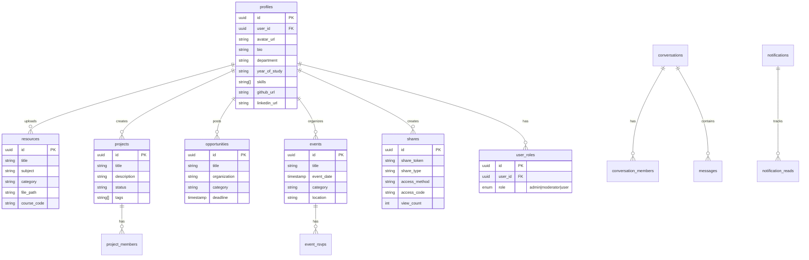

<div align="center">

<!-- Animated Banner -->


<!-- Logo -->
<br/>


<br/>
<br/>

<!-- Typing Animation -->
<a href="https://git.io/typing-svg">
  
</a>

<br/>
<br/>

<!-- Badges Row 1 -->


<br/>

<!-- Badges Row 2 -->


<br/>

<!-- Status Badges -->


<br/>
<br/>

<!-- Navigation Links -->
[🚀 Live Demo](#-live-demo) • [✨ Features](#-features) • [🏗️ Tech Stack](#%EF%B8%8F-tech-stack) • [🚀 Getting Started](#-getting-started) • [📁 Structure](#-project-structure) • [🗄️ Database](#%EF%B8%8F-database-schema) • [🔒 Security](#-security)

</div>

---

## 🌟 What is StudentHub?

> **StudentHub** is a full-stack Progressive Web App built for students. One platform to share study materials, discover internships and scholarships, collaborate on projects, attend campus events, and stay connected with your entire student community — all wrapped in a beautiful, fast, mobile-first experience.

<div align="center">

</div>

---

## 🎬 Live Demo

<div align="center">

[](https://gensync-78.vercel.app/)

</div>

---

## ✨ Features

<details>
<summary><b>🔐 Authentication & Profiles</b></summary>
<br/>

| Feature | Details |
|---------|---------|
| 🔑 Email Login | Secure email/password auth with verification |
| 👤 Rich Profiles | Bio, skills, department, year, avatar, social links |
| 🛡️ Role System | Admin, Moderator, and User roles with RLS policies |
| 🔒 Auth Guards | Protected routes with client-side guards |

</details>

<details>
<summary><b>📚 Resources & Study Materials</b></summary>
<br/>

| Feature | Details |
|---------|---------|
| 📤 Upload Materials | Share notes, slides, and past papers |
| 🏷️ Course Codes | Tag resources with course codes |
| 🗂️ Categories | Organized by subject and type |
| 📥 Downloads | Tracked secure file downloads |

</details>

<details>
<summary><b>💼 Opportunities</b></summary>
<br/>

| Feature | Details |
|---------|---------|
| 🎓 Scholarships | Browse and filter scholarship listings |
| 💼 Internships & Jobs | Find opportunities from verified organizations |
| 🏆 Competitions | Discover hackathons and contests |
| ⏰ Deadlines | Filter by deadline so you never miss out |

</details>

<details>
<summary><b>🚀 Projects & Collaboration</b></summary>
<br/>

| Feature | Details |
|---------|---------|
| 🛠️ Create Projects | Start a campus project with a description and tags |
| 👥 Team Members | Invite others and collaborate |
| 📊 Status Tracking | Track open, in-progress, and completed projects |
| 🔗 Share Links | Generate shareable links with access codes & expiry |

</details>

<details>
<summary><b>📅 Events</b></summary>
<br/>

| Feature | Details |
|---------|---------|
| 📅 Event Listings | Campus events with date, location, and category |
| ✅ RSVP | Confirm attendance directly in the app |
| ⏰ Reminders | Get notified before events start |
| 🎛️ Filters | Filter by Academic, Social, Workshop, Career |

</details>

<details>
<summary><b>🛠️ Admin Dashboard</b></summary>
<br/>

| Feature | Details |
|---------|---------|
| 📢 Announcements | Broadcast platform-wide notifications |
| 💡 Daily Tips | Manage rotating student tips |
| 👥 User Management | View users, assign/revoke roles |
| 📈 Analytics | Platform usage stats & charts |
| 🗄️ Storage Manager | Monitor file storage consumption |
| ⚙️ Point System | Configure gamification rules |

</details>

<details>
<summary><b>📱 PWA & UX</b></summary>
<br/>

| Feature | Details |
|---------|---------|
| 📲 Installable | Works as a native app on mobile & desktop |
| 🌙 Dark Mode | Full dark/light theme toggle |
| 🎞️ Animations | Smooth page transitions with Framer Motion |
| 📡 Offline Ready | Service worker caching |
| 📱 Responsive | Mobile-first design throughout |

</details>

---

## 🏗️ Tech Stack

<div align="center">

<table>
  <tr>
    <td align="center" width="110">
      <br/>
      <b>React 18</b>
    </td>
    <td align="center" width="110">
      <br/>
      <b>TypeScript</b>
    </td>
    <td align="center" width="110">
      <br/>
      <b>Vite 5</b>
    </td>
    <td align="center" width="110">
      <br/>
      <b>Tailwind CSS</b>
    </td>
    <td align="center" width="110">
      <br/>
      <b>Supabase</b>
    </td>
    <td align="center" width="110">
      <br/>
      <b>Vercel</b>
    </td>
  </tr>
</table>

</div>

```
📦 Key Dependencies
├── 🎨  UI & Styling
│   ├── shadcn/ui          → 40+ accessible, customizable components
│   ├── Tailwind CSS 3.4   → Utility-first styling
│   ├── Framer Motion      → Smooth animations & page transitions
│   └── Lucide React       → Clean, consistent icon set
│
├── 📡  Backend & Data
│   ├── Supabase           → Auth, PostgreSQL DB, Storage, Edge Functions
│   ├── TanStack Query     → Server state, caching & background sync
│   └── React Hook Form    → Performant forms with Zod schema validation
│
├── 🧭  Routing & SEO
│   ├── React Router DOM   → Client-side routing
│   └── react-helmet-async → Dynamic meta tags & JSON-LD structured data
│
├── 📊  Visualization
│   └── Recharts           → Charts & analytics graphs
│
└── 📱  PWA
    └── vite-plugin-pwa    → Service worker, manifest & offline support
```

---

## 🚀 Getting Started

### Prerequisites

- **Node.js** ≥ 18.x
- **npm** or **bun**
- A [Supabase](https://supabase.com) project

### Installation

```bash
# 1️⃣  Clone the repository
git clone <YOUR_GIT_URL>

# 2️⃣  Navigate into the project
cd share2all

# 3️⃣  Install dependencies
npm install

# 4️⃣  Set up environment variables
cp .env.example .env
```

### Environment Variables

Open `.env` and fill in your Supabase project credentials:

```env
VITE_SUPABASE_URL=your_supabase_project_url
VITE_SUPABASE_ANON_KEY=your_supabase_anon_key
```

```bash
# 5️⃣  Start the development server
npm run dev
```

> 🎉 App running at **http://localhost:8080**

---

## 📜 Available Scripts

| Command | Description |
|---------|-------------|
| `npm run dev` | Start dev server with HMR |
| `npm run build` | Production build |
| `npm run build:dev` | Development build |
| `npm run preview` | Preview production build locally |
| `npm run test` | Run tests once |
| `npm run test:watch` | Run tests in watch mode |
| `npm run lint` | Lint with ESLint |

---

## 📁 Project Structure

```
📦 studenthub/
├── 📂 public/
│   ├── 🖼️  favicon.ico
│   ├── 🖼️  pwa-icon-192.png
│   ├── 🖼️  pwa-icon-512.png
│   ├── 🤖  robots.txt
│   └── 🗺️  sitemap.xml
│
├── 📂 src/
│   ├── 📂 assets/                  # Static images & media
│   │
│   ├── 📂 components/
│   │   ├── 📂 ui/                  # shadcn/ui base components (40+)
│   │   ├── AppLayout.tsx           # Main app shell
│   │   ├── AppSidebar.tsx          # Navigation sidebar
│   │   ├── Navbar.tsx              # Top navigation bar
│   │   ├── MobileNav.tsx           # Mobile navigation drawer
│   │   ├── ProtectedRoute.tsx      # Auth guard wrapper
│   │   ├── ShareDialog.tsx         # Share link generator
│   │   ├── EventReminders.tsx      # Upcoming event alerts
│   │   ├── AnnouncementsBanner.tsx # Platform announcements
│   │   ├── SEO.tsx                 # Meta tags & JSON-LD
│   │   ├── PageTransition.tsx      # Framer Motion transitions
│   │   └── PwaInstallPrompt.tsx    # PWA install banner
│   │
│   ├── 📂 hooks/
│   │   ├── useAuth.tsx             # Auth state & context
│   │   ├── useIsAdmin.tsx          # Admin role helper
│   │   └── use-mobile.tsx          # Responsive breakpoint hook
│   │
│   ├── 📂 integrations/
│   │   └── supabase/               # Auto-generated client & types
│   │
│   ├── 📂 pages/
│   │   ├── Index.tsx               # 🏠 Landing page
│   │   ├── Auth.tsx                # 🔐 Login & signup
│   │   ├── Dashboard.tsx           # 📊 User dashboard
│   │   ├── Admin.tsx               # ⚙️  Admin panel
│   │   ├── Events.tsx              # 📅 Event listings
│   │   ├── Opportunities.tsx       # 💼 Job & scholarship board
│   │   ├── Profile.tsx             # 👤 User profile
│   │   ├── Projects.tsx            # 🚀 Project hub
│   │   ├── Resources.tsx           # 📚 Study materials
│   │   ├── Shares.tsx              # 🔗 Shared content manager
│   │   ├── Community.tsx           # 👥 Community page
│   │   ├── ActivityFeed.tsx        # 📡 Activity feed
│   │   ├── Bookmarks.tsx           # 🔖 Saved items
│   │   └── SharedView.tsx          # 🌐 Public shared content
│   │
│   ├── App.tsx                     # Root component & routes
│   ├── index.css                   # Global styles & design tokens
│   └── main.tsx                    # App entry point
│
├── 📂 supabase/
│   ├── config.toml                 # Supabase local config
│   └── 📂 functions/
│       └── list-users/             # Edge function for admin user listing
│
└── 📄 Config Files
    ├── vite.config.ts
    ├── tailwind.config.ts
    ├── tsconfig.json
    └── package.json
```

---

## 🗄️ Database Schema



---

## 🎨 Design System

<div align="center">

| Token | Purpose | Preview |
|-------|---------|---------|
| `--background` | Page background |  |
| `--foreground` | Primary text |  |
| `--primary` | Brand accent |  |
| `--secondary` | Secondary elements |  |
| `--accent` | Highlighted elements |  |
| `--destructive` | Error/danger states |  |

</div>

Full dark/light mode support using HSL-based CSS design tokens.

---

## 🔒 Security

<div align="center">

| ✅ | Security Measure |
|----|-----------------|
| 🔐 | Row-Level Security (RLS) on every database table |
| 🛡️ | Role-based access control — Admin, Moderator, User |
| ⚙️ | Server-side role validation via `has_role()` security definer |
| 📁 | Authenticated-only access to protected file storage |
| 📧 | Email verification required on signup |
| 🚧 | Client-side protected routes with auth guards |
| 🔑 | No sensitive credentials exposed in client code |

</div>

---

## 🌐 SEO & Performance

- ✅ JSON-LD structured data (WebApplication, Organization, WebSite)
- ✅ Dynamic meta tags with `react-helmet-async`
- ✅ `robots.txt` and `sitemap.xml` included
- ✅ Google Search Console verified
- ✅ PWA with service worker caching for offline support
- ✅ Responsive, mobile-first layout

---

## ☁️ Deployment

The app is configured for **Vercel** deployment. To deploy:

1. Push to your connected Git repository
2. Vercel auto-detects the Vite config and deploys

Add your environment variables in the Vercel project settings:

```
VITE_SUPABASE_URL
VITE_SUPABASE_ANON_KEY
```

### Supabase Free Tier Limits

| Resource | Limit |
|----------|-------|
| 🗄️ Database | 500 MB |
| 📁 File Storage | 1 GB |
| 🌐 Bandwidth | 5 GB / month |
| ⚡ Edge Functions | 500K invocations / month |
| 🔌 Realtime | 200 concurrent connections |

---

## 📊 Activity

<div align="center">

</div>

---

## 👨‍💻 Author

<div align="center">


### **GenSync**
*Founder & Developer*

[]((https://gensync-78.vercel.app/))

</div>

---

## 🤝 Contributing

Contributions, issues, and feature requests are welcome!

1. Fork the repo
2. Create a feature branch: `git checkout -b feature/amazing-feature`
3. Commit your changes: `git commit -m 'Add amazing feature'`
4. Push to the branch: `git push origin feature/amazing-feature`
5. Open a Pull Request

---

<div align="center">

<!-- Footer Wave -->


<br/>

**⭐ Star this repo if StudentHub made your campus life better!**

<br/>

*Made with ❤️ by GenSync · Built for students, by students*

</div>
